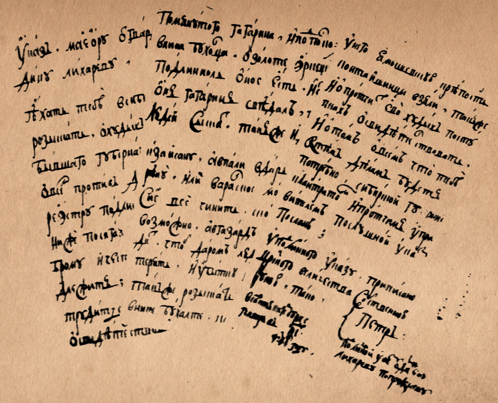
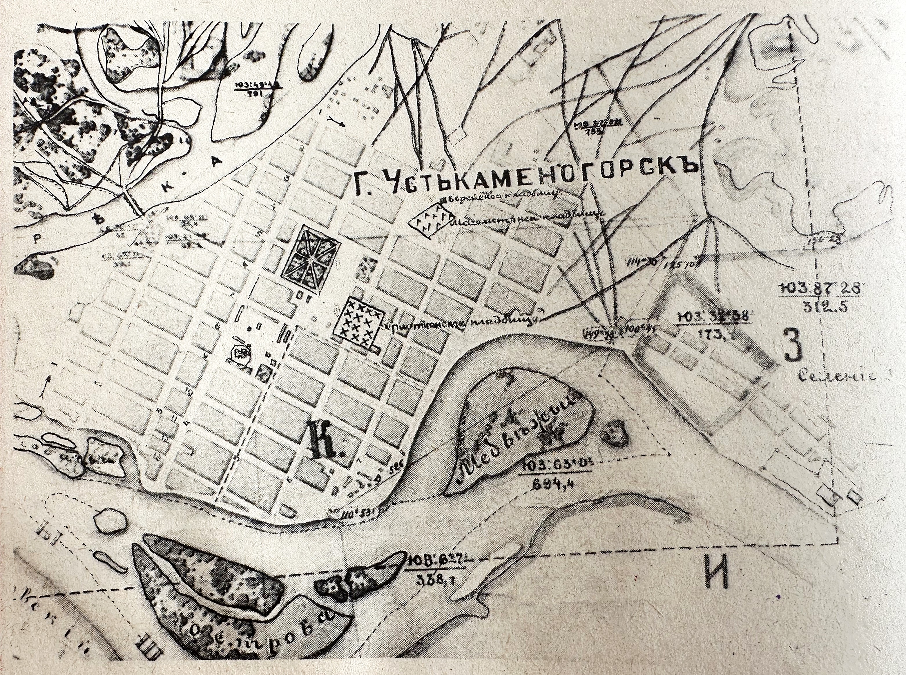
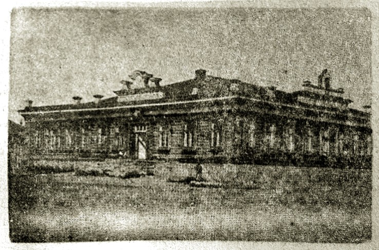
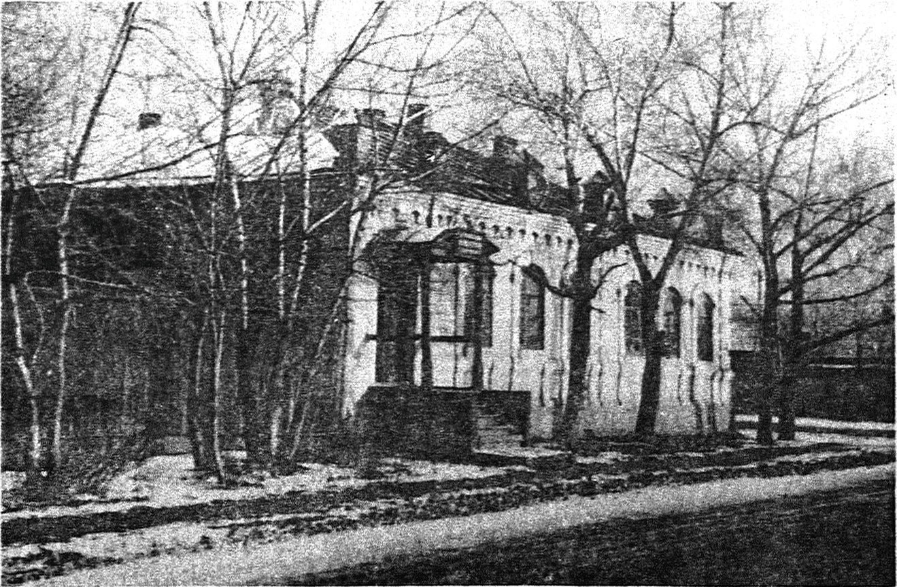
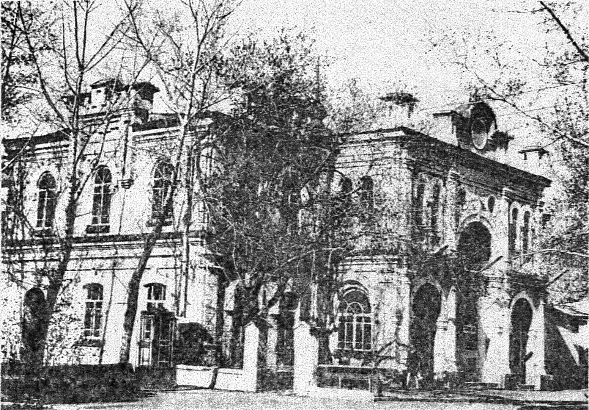
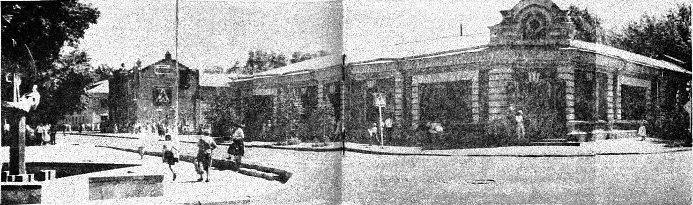
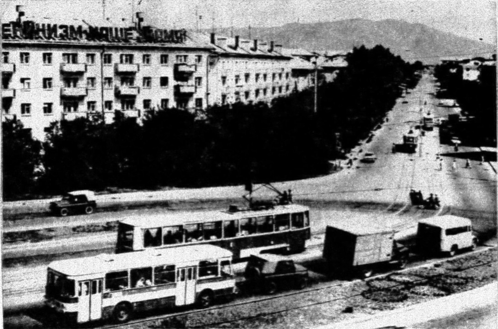
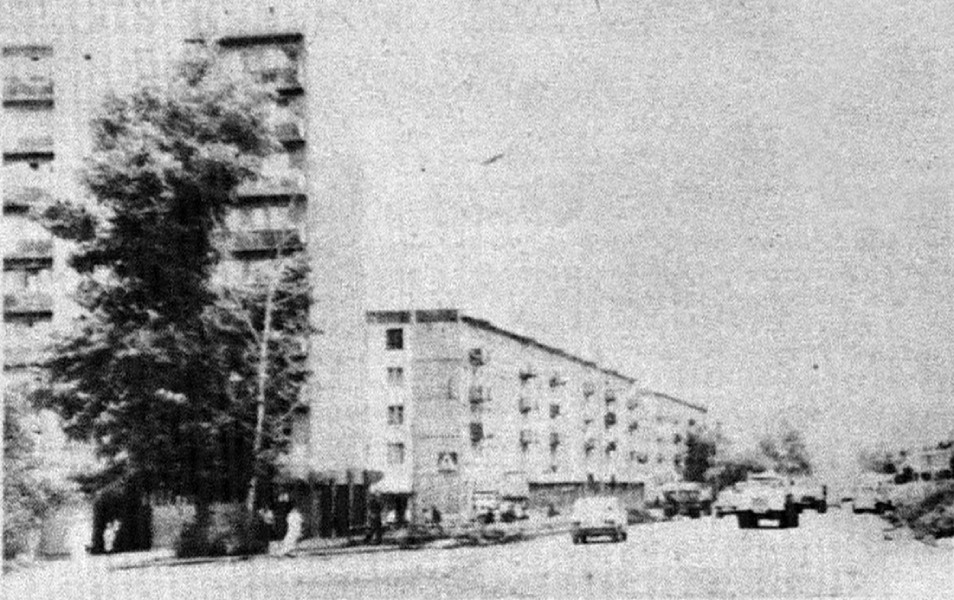

## ШТРИХИ К ПОРТРЕТУ ГОРОДА. <br> УСТЬ-КАМЕНОГОРСКУ 270 ЛЕТ <br> (1720-1990)
#### Г. П. Андрусенко, О. В. Жандабекова, С. Е. Черных
#### 1990 г.

В последние годы в нашем обществе стал проявляться живой интерес к истории государства и своего малого отечества. Хоть в какой-то мере удовлетворить интерес устькаменогорцев к истории своего города стремились авторы данной брошюры. Она подготовлена на основе архивных документов, некоторые фотографии с видами дореволюционного города предоставлены Восточно-Казахстанским облпартархивом.

---

ИЗ ЗАПИСОК ОСНОВАТЕЛЯ СЕМИПАЛАТИНСКОГО ПОДОТДЕЛА РОССИЙСКОГО ГЕОГРАФИЧЕСКОГО ОБЩЕСТВА СВЯЩЕННИКА БОРИСА ГЕОРГИЕВИЧА ГЕРАСИМОВА ВО ВРЕМЯ ПОЕЗДКИ ЛЕТОМ **1905г**. НА РАХМАНОВСКИЕ КЛЮЧИ

---
<br>

С дороги от села Прапорщиковского[^1] открываются живописные виды на синеющие за Иртышом горные хребты и устье каменных гор, из которых вырывается Иртыш. Отроги гор довольно близко подходят к дороге. С некоторыми горными вершинами соединяются различные легендарные рассказы. Так, `верстах в 10` от Устькаменогорска, несколько в стороне от прапорщиковского тракта, заметным горбом чернеется гора Орёл. Много лет тому назад в этой горе жил один смелый разбойник, который, как орел, выглядывал себе добычу и набрасывался на неё с дерзкой отвагой. На Орле есть пещера. 

Предместье Устькаменогорска отстоит от города `верстах в пяти`. Называется оно Защитой и состоит из нескольких небольших домиков. Предместье получило название Защиты потому, что некогда представляло из себя сторожевой военный пост, который дозирал окрестности. С течением же времени, когда край был замирен, Защита обратилась в маленький поселок, жители которого предались мирному сельскому хозяйству. Верстах в двух-трех далее от Защиты начинается г.Устькаменогорск. Эта часть города отделена от центрального города рекой Ульбой и называется Хохладская заимка.

<figure>
  <a href="/photos/postcards-gorlov/vid-s-pozharnogo-depo/">
    
  </a>
  <figcaption><p align="center">1. Вид с пожарного депо на центральную часть города. Начало XX в.</p></figcaption>
</figure>

Крестьяне окрестных сел называют её еще Долгой деревней. И то и другое название заречной части города вполне верно определяет её характер.

Заимка представляет из себя по виду большое и длинное село, населенное выходцами из южных губерний — малороссами. Белые плетневые мазанки нередко с соломенными крышами, большие скирды кизяку, малороссийский выговор заимцев сразу переносят вас в типичную деревню Полтавской или Черниговской губерний. Проходят годы, а хохлы остаются все теми же прочно установившимися в своей этнографической особенности полтавцами и воронежцами, каких можно встретить в Европейской России. На заимке выстроены: деревянная церковь (на средства церк. — пр. попечит.) и хорошее каменное здание министерского училища. Есть и церковно-приходская школа. Заречная заимка соединяется с городом деревянным мостом, построенным через Ульбу на больших карбазах, которые в половодье убираются. Мост совершенно гарантирует удобство сообщения с городом. Плата за переправу низкая. До постройки моста в город попадали с помощью парома. Предоставляем судить самому читателю, насколько был удобен этот способ переправы, особенно в моменты скопления крестьянского люда, имеющего постоянное сообщение с городом. Устькаменогорск стоит при слиянии двух рек — Иртыша и Ульбы и при устье каменных гор.

Последнее обстоятельство и послужило причиною названия города. От Устькаменогорска в разные стороны расходится множество гор. Устькаменогорск — чистенький и довольно веселый городок. За последние годы в нем появилось много садов, весьма кстати декорирующих город.

<figure>
  <a href="./img/1719-ukaz-petr-i.jpg">
    
  </a>
  <figcaption><p align="center">Копия указа Петра I об экспедиции гвардии майора И. М. Лихарева.</p></figcaption>
</figure>

Устькаменогорск имеет свою историю. Гораздо ранее самого города появилась Устькаменогорская крепость. Построение ее произошло в связи со следующими обстоятельствами: по указу Императора Петра Великого, написанному им собственноручно, приказано было построить крепость у озера Зайсана. В силу означенного указа в **1715** г. был отправлен из Тобольска на шести досчаниках с отрядом солдат около `3000 человек` бригадир [Бухгольц](https://ru.wikipedia.org/wiki/%D0%91%D1%83%D1%85%D0%B3%D0%BE%D0%BB%D1%8C%D1%86,_%D0%98%D0%B2%D0%B0%D0%BD_%D0%94%D0%BC%D0%B8%D1%82%D1%80%D0%B8%D0%B5%D0%B2%D0%B8%D1%87), который в том же **1715** г. основал [крепость Ямышевскую](https://ru.wikipedia.org/wiki/%D0%AF%D0%BC%D1%8B%D1%88%D0%B5%D0%B2%D1%81%D0%BA%D0%B0%D1%8F_%D0%BA%D1%80%D0%B5%D0%BF%D0%BE%D1%81%D1%82%D1%8C). Но будучи осажден джунгарами, с большим уроном отступил к устью реки Оми и в **1716** г. основал [Омскую крепость](https://ru.wikipedia.org/wiki/%D0%9E%D0%BC%D1%81%D0%BA%D0%B0%D1%8F_%D0%BA%D1%80%D0%B5%D0%BF%D0%BE%D1%81%D1%82%D1%8C).

В **1720** г. команду от Бухгольца над отрядом, в числе около `440 человек`, принял генерал-майор [Лихарев](https://ru.wikipedia.org/wiki/%D0%9B%D0%B8%D1%85%D0%B0%D1%80%D0%B5%D0%B2,_%D0%98%D0%B2%D0%B0%D0%BD_%D0%9C%D0%B8%D1%85%D0%B0%D0%B9%D0%BB%D0%BE%D0%B2%D0%B8%D1%87), командированный из Петербурга с артиллерийскими орудиями и разными запасами. Он отправился из Тобольска вверх по Иртышу до озера Зайсана на `34 досчаниках` и лодках и по дороге возобновил Ямышевскую крепость. Достигнув озера Зайсана, не нашел на берегах его удобного места для крепости и проплыл далее в Черный Иртыш. На `12-й день` плавания по Иртышу подвергся сильному нападению со стороны джунгар. После `3-хдневной` битвы с джунгарами, заключил с предводителем их — царевичем мир. Возвращаясь обратно, генерал Лихарев заложил в **1720** г. Устькаменогорскую крепость на том месте, на котором находится она и теперь. Во вновь образованную крепость был командирован из Европейской России [драгунский полк](https://ru.wikipedia.org/w/index.php?title=%D0%A1%D0%B8%D0%B1%D0%B8%D1%80%D1%81%D0%BA%D0%B8%D0%B9_%D0%B4%D1%80%D0%B0%D0%B3%D1%83%D0%BD%D1%81%D0%BA%D0%B8%D0%B9_%D0%B3%D0%B0%D1%80%D0%BD%D0%B8%D0%B7%D0%BE%D0%BD%D0%BD%D1%8B%D0%B9_%D0%BF%D0%BE%D0%BB%D0%BA&oldformat=true#%D0%98%D1%81%D1%82%D0%BE%D1%80%D0%B8%D1%8F), называвшийся колыванским. С полком прибыл [иеромонах Георгий](https://archive.org/details/20260611_20260611_0725#page=26), который отправлял Богослужение в походной церкви. Иконы были написаны на голубом китайском штофе, натянутом на дубовых складных рамах, пожертвованных потом в омский собор. Позднее в крепости была построена небольшая деревянная церковь, крытая берестом, с отдельной колокольней. Эта церковь впоследствии сгорела. Вместо неё грамотой митрополита тобольского и сибирского Павла приказано заказчику омского духовного правления "пречестному протопресвитеру Петру Федорову вновь заложить в Устькаменогорской крепости деревянную церковь. Последняя по грамоте [архиепископа тобольского и сибирского Варлаама](https://ru.wikipedia.org/wiki/%D0%92%D0%B0%D1%80%D0%BB%D0%B0%D0%B0%D0%BC_(%D0%9F%D0%B5%D1%82%D1%80%D0%BE%D0%B2)) от **30 октября 1774** г. была освящена **6-го июня 1775** г.

Вместо этой церкви, пришедшей в ветхость, грамотою того же архиепископа тобольского и сибирского Варлаама от **18 сентября 1786** г. предписано барнаульскому заказчику протоиерею [Дометию Комарову](https://ru.wikipedia.org/wiki/%D0%94%D0%BE%D0%BC%D0%B5%D1%82%D0%B8%D0%B9_%D0%9A%D0%BE%D0%BC%D0%B0%D1%80%D0%BE%D0%B2) заложить в Устькаменогорской крепости новую, каменную церковь, закладка каковой и состоялась **26 июня 1789** г. Каменная церковь окончена постройкой в **1809** г., освящена **9-го сентября 1810** г. Церковь построена на инженерные суммы. При церкви хранится план, снятый с натуры **1834г. 25 октября**. Росписи населения ведутся с **1784** г. Архитектура церкви сразу же изобличает старинную постройку **.
>** В церковной ограде есть две могилы, на которых лежат чугунные плиты со следующими надписями: Первая — "здесь лежит тело усопшего господина генерал-майора [Павла Матвеевича Скобельцина](https://ru.wikipedia.org/wiki/%D0%A1%D0%BA%D0%BE%D0%B1%D0%B5%D0%BB%D1%8C%D1%86%D1%8B%D0%BD,_%D0%9F%D0%B0%D0%B2%D0%B5%D0%BB_%D0%9C%D0%B0%D1%82%D0%B2%D0%B5%D0%B5%D0%B2%D0%B8%D1%87), бывшего в [Селенгинском полку](https://ru.wikipedia.org/wiki/%D0%A1%D0%B5%D0%BB%D0%B5%D0%BD%D0%B3%D0%B8%D0%BD%D1%81%D0%BA%D0%B8%D0%B9_41-%D0%B9_%D0%BF%D0%B5%D1%85%D0%BE%D1%82%D0%BD%D1%8B%D0%B9_%D0%BF%D0%BE%D0%BB%D0%BA) шефом, который за службу и ревность награжден орденами святой Анны 2-й и 3-й степени, от роду имел `32 года` и скончался в **1799 году сентября на 12-е** число и в достопамятство сделана сия генерал-майором и кавалером Зубовым". Вторая: "Здесь положено тело княгини Варвары Матвеевны, урожденной княжны Баратаевой, супруги премьер-майора [князя Степана Давыдовича Эристова](https://ru.wikipedia.org/wiki/%D0%AD%D1%80%D0%B8%D1%81%D1%82%D0%BE%D0%B2,_%D0%A1%D1%82%D0%B5%D0%BF%D0%B0%D0%BD_%D0%94%D0%B0%D0%B2%D1%8B%D0%B4%D0%BE%D0%B2%D0%B8%D1%87), которая родилась **1749** г., скончалась **1785 г. февраля 8-го** дня. Жизни её было `35 лет два месяца и 8 дней`". В Устькаменогорске сохранилось предание, которое говорит, что у князя Эристова жили две высланные из Петербурга фрейлины, которых князь по возвращении из Сибири увез обратно в Европейскую Россию. Вероятно, фрейлины были прощены.

Крепость окружена довольно высокими валами, которые, несмотря на свою давность, держатся прочно. Наружные боковые стороны валов заканчиваются искусственными рвами. В крепости построены казармы для солдат, военный госпиталь, квартиры военноначальствующих лиц, различные кладовые для надобностей военного ведомства, отделение "каторжной тюрьмы".

В настоящее время большое здание каменной казармы, в которой помещались пехотинцы и кавалеристы (артиллеристы конно-горной легкой батареи), стоит заброшенным и грозит развалиться. В тени этого здания находит себе приют разный бродячий скот.

Здание "каторжной тюрьмы" впоследствии было обращено в казарму; теперь же стоит заброшенным. Только остроконечные [пали](https://ru.wikipedia.org/wiki/%D0%9F%D0%B0%D0%BB%D0%B8%D1%81%D0%B0%D0%B4) вокруг него красноречиво свидетельствуют о том, для кого первоначально была предназначена заброшенная теперь казарма. Устькаменогорская крепость была выстроена в стратегических целях. Когда надобность в крепости как военном оплоте миновала, в высших правительственных сферах поднялся вопрос об упразднении крепости. По этому поводу военный губернатор Семипалатинской области послал от **21 февраля 1877** г. на имя устькаменогорского городского головы следующую бумагу: "В приказе г. военного министра от **6-го ноября 1876** г. за №331 объявлено по военному ведомству, что [Государь Император](https://ru.wikipedia.org/wiki/%D0%90%D0%BB%D0%B5%D0%BA%D1%81%D0%B0%D0%BD%D0%B4%D1%80_II) в **28 день октября 1877** г. повелеть соизволил: крепости Петропавловскую, Устькаменогорскую и укрепление Акмолинское окончательно упразднить, и змели, занятые [верками](https://ru.wikipedia.org/wiki/%D0%92%D0%B5%D1%80%D0%BA_(%D1%84%D0%BE%D1%80%D1%82%D0%B8%D1%84%D0%B8%D0%BA%D0%B0%D1%86%D0%B8%D1%8F)) и [экспланадами](https://ru.wikipedia.org/wiki/%D0%AD%D1%81%D0%BF%D0%BB%D0%B0%D0%BD%D0%B0%D0%B4%D0%B0), передать городам с тем, чтобы вокруг упраздненных укреплений, для отделения казенных строений от частных, городами были расположены сады".

Городская дума, ознакомившись с содержанием вышеприведенной бумаги военного губернатора, поручила городской управе заняться верками и экспланадами.

В то время, как управа намеревалась исполнить поручение думы, от военного губернатора Семипалатинской области городским головой было получено от **28 июля 1879** г. следующее новое уведомление: "В виду некоторых политическо-военных соображений и по другим причинам, находя необходимым оставить временно бывшую крепость по-прежнему в ведении местного коменданта, прошу вас приостановить исполнение поручения думы впредь до особого распоряжения".

Надобность в крепости, впрочем, быстро миновала. **25 октября 1879** г. военная администрация уведомила городского голову, что "необходимость во временном оставлении Устькаменогорской крепости по-прежнему в ведении коменданта ныне миновала, а потому не имеется препятствий к передаче в ведение города верков и экспланады".

Передача состоялась **27-го ноября 1879** г. Результатом передачи явился акт, подписанный представителями военного ведомства и города. Таким образом, крепость как военный стратегический пункт перестала существовать. Первое оседлое население Устькаменогорска появилось в крепости. Здесь находилась даже лавка с разными товарами. Затем была сделана попытка поселиться недалеко от крепости. Первые дома вне крепости были выстроены вблизи укрепления, под так называемыми "ветелками". Так было положено основание городу. Постепенно город стал увеличиваться и разрастаться. В настоящее время в городе насчитывается до `десяти тысяч жителей`. Крепость отделена от города площадью. В жизни Устькаменогорска бывали печальные дни, когда ему приходилось частью выгорать, частью же терпеть большой урон от наводнений. Так, в **июле 1834** г. пожар истребил `20 домов`, **22 апреля 1846** г. — `45 домов`. Эти пожары довольно существенно сократили и без того небольшие размеры города.

От наводнений город сильно пострадал в **1889**, **1891** и **1904** годах. Для предохранения города от наводнений городским управлением были выстроены дамбы по берегам Иртыша и Ульбы. В прежние годы случавшиеся на Иртыше заторы разбивались стрельбою из крепостных пушек.

Устькаменогорск производит приятное впечатление некоторой благоустроенностью. В центре города высится красивое здание [народного дома](https://ru.wikipedia.org/wiki/%D0%92%D0%BE%D1%81%D1%82%D0%BE%D1%87%D0%BD%D0%BE-%D0%9A%D0%B0%D0%B7%D0%B0%D1%85%D1%81%D1%82%D0%B0%D0%BD%D1%81%D0%BA%D0%B8%D0%B9_%D1%82%D0%B5%D0%B0%D1%82%D1%80_%D0%B4%D1%80%D0%B0%D0%BC%D1%8B_%D0%B8%D0%BC%D0%B5%D0%BD%D0%B8_%D0%96%D0%B0%D0%BC%D0%B1%D1%8B%D0%BB%D0%B0) с поместительным залом и хорами. В здании народного дома помещаются библиотеки, музей, городская управа и чайная комитета трезвости. Из училищ в Устькаменогорске имеются 3-хклассное городское, мариинское женское, приходская мужская школа, приходская женская, татарская школа и казачье училище. Улицы вымощены дресвой. Относительным культурным благоустройством Усть-Каменогорск обязан энергичному составу гласных, стоявших во главе общественного управления в последние два четырехлетия.

Сообщение со степью производится с помощью двух [самолетов](https://ru.wikipedia.org/wiki/%D0%A0%D0%B5%D0%B0%D0%BA%D1%86%D0%B8%D0%BE%D0%BD%D0%BD%D1%8B%D0%B9_%D0%BF%D0%B0%D1%80%D0%BE%D0%BC): верхнего — казенного прямо Пристани и нижнего — городского — прямо крепости. Благодаря быстрому течению, нижний самолет перебегает Иртыш в `3-4 минуты`. Верхний действует медленнее.

Рядом с городом расположена Устькаменогорская станица, у которой с горожанами идут бесконечные земельные споры. Особенно обездоленными в земле оказались жители Заимки. Прямо крепости на левой стороне Иртыша не особенно давно обосновался Устькаменогорский казачий поселок, куда иногда съезжаются дачники на кумыс. Выше города, почти при самом устье гор, у подошвы каменного хребта приютилось село [Томской губернии](https://ru.wikipedia.org/wiki/%D0%A2%D0%BE%D0%BC%D1%81%D0%BA%D0%B0%D1%8F_%D0%B3%D1%83%D0%B1%D0%B5%D1%80%D0%BD%D0%B8%D1%8F) Пристань. На Пристани еще и сейчас видны остатки разной руды, которая раньше сплавлялась на карбазах из Зыряновского рудника и громадными кучами ссыпалась на Пристани. Отсюда руда развозилась крестьянами по разным плавильным заводам [Барнаульского уезда](https://ru.wikipedia.org/wiki/%D0%91%D0%B0%D1%80%D0%BD%D0%B0%D1%83%D0%BB%D1%8C%D1%81%D0%BA%D0%B8%D0%B9_%D1%83%D0%B5%D0%B7%D0%B4), где и перерабатывалась на соответствующий металл. Пристанцы в период расцвета горнопромышленной деятельности [Зыряновского рудника](https://ru.wikipedia.org/wiki/%D0%97%D1%8B%D1%80%D1%8F%D0%BD%D0%BE%D0%B2%D1%81%D0%BA%D0%B8%D0%B9_%D1%80%D1%83%D0%B4%D0%BD%D1%8B%D0%B9_%D1%80%D0%B0%D0%B9%D0%BE%D0%BD) почти все сплошь занимались сплавкой руды, которую принимал на Пристани горный пристав. Впоследствии местом для склада руды был назначен [Убинский форпост](https://ru.wikipedia.org/wiki/%D0%A3%D0%B1%D0%B0-%D0%A4%D0%BE%D1%80%D0%BF%D0%BE%D1%81%D1%82) (ныне станица), откуда руда и отправлялась по заводам. В настоящее время пристанцы занимаются главным образом хлебопашеством. Пристань обосновалась на [кабинетской земле](https://ru.wikipedia.org/wiki/%D0%98%D0%BC%D0%BF%D0%B5%D1%80%D0%B0%D1%82%D0%BE%D1%80%D1%81%D0%BA%D0%B8%D0%B9_%D0%BA%D0%B0%D0%B1%D0%B8%D0%BD%D0%B5%D1%82#%D0%9A%D0%B0%D0%B1%D0%B8%D0%BD%D0%B5%D1%82%D0%BD%D1%8B%D0%B5_%D0%B2%D0%BB%D0%B0%D0%B4%D0%B5%D0%BD%D0%B8%D1%8F). Город благодаря своему росту близко подошел к Пристани и, вероятно не в далеком будущем соединится с ней. Пристань отделяет от города большая канава, устроенная городом для стока в Иртыш снеговой, горной воды.

В окрестностях Устькаменогорска находится много пасек, среди которых попадаются с рамочными ульями. В Устькаменогорских горах, `верстах в 8` от города, можно встретить громадный вкопанный в землю, но уже сильно накренившийся "каменный столб". Со столбом связано предание, которое гласит, что к каменному столбу один богатырь, живший некогда в горах, привязывал своего коня. В верхней части столба виднеется довольно заметная выемка — след, по преданию, от лошадиного повода. Далее столба, `версты на две`, вырабатывается прекрасный известняк. Жители города занимаются хлебопашеством, скотоводством и пчеловодством. Из Устькаменогорска я выехал на лошадях по алтайскому тракту, к поселку Ульбинскому (`27 в.`) В `десяти верстах` от города расположено село Согринское (Томск.губ). Дорога к нему пролегает по гладкой равнине. Село прорезает речка Согра, с северо-западной стороны которой внушительно острыми утесами спускается к почтовой дороге и деревянному мостику через Согру так называемая Заседательская сопка. Название горе дано вследствие того, что здесь некогда разбился насмерть земский заседатель, прыгнувший с вершины горы вниз на утесы. Следующие `десять верст` дорога идёт также по ровному месту, почти параллельно берегу реки Ульбы.

<br>
<br>

Записки Семипалатинского подотдела
<br>
[Русского Географического Общества](https://ru.wikipedia.org/wiki/%D0%A0%D1%83%D1%81%D1%81%D0%BA%D0%BE%D0%B5_%D0%B3%D0%B5%D0%BE%D0%B3%D1%80%D0%B0%D1%84%D0%B8%D1%87%D0%B5%D1%81%D0%BA%D0%BE%D0%B5_%D0%BE%D0%B1%D1%89%D0%B5%D1%81%D1%82%D0%B2%D0%BE)
<br>
Выпуск 1⊥1, Семипалатинск, **1907**.

<br>
<br>

Восточно-Казахстанский облгосархив,
<br>
ф. Р-1070, оп 1, д. 2, лл. 6-9.

<br>
<br>

---

<br>
<br>

**ВО ВТОРОЙ половине 18 века** около крепости Усть-Каменогорской стали оседать переселенцы. Первооснову городу положили улицы Ильинская, Троицкая, Большая, Андреевская. Они начинались от берега р. Иртыша и застраивались вдоль р. Ульбы к горам жилыми постройками, общественными зданиями, торговыми домами. Их пересекали переулки Соляной, Крепостной, Мечетский, Соборный, которые брали начало от берега р. Иртыша и его протоки у острова Медвежьего (ныне Пионерского) и кончались на берегу р. Ульбы. Воспроизвести облик города начала нашего столетия позволяют фотографические открытки, изданные в местной типографии Горлова.

Старые карты города показывают строгую прямолинейность улиц и переулков, планировка которых способствовала тому, что город постоянно продувался свежими ветрами с гор, а в период наводнений мощь воды ослаблялась тем, что расходилась по многим переулкам. Город разрастался, а традиция поддерживалась. Но когда-то произошло так, что стало модным первоначально возникшие наименования улиц заменять новыми, чаще всего не имеющими отношения к истории города. А в эпоху интенсивного жилищного строительства стали исчезать одна за другой улицы, как будто чья-то рука сознательно старалась не оставить никаких следов от исторически сложившегося центра разрастающегося города.

<figure>
  <a href="./img/1906-ustkamenogorsk-plan.jpg">
    
  </a>
  <figcaption><p align="center">План г. Усть-Каменогорска. <b>1906</b> г.<br>1. Покровский собор, П.Городской сад. Ш - Христианское кладбище, 1У - Магометанское кладбище, У-Еврейское кладбище.<br>Улицы (слева направо): 1 - Береговая, 2-Ильинская, 3-Троицкая, 4-Большая, 5-Андреевская, 6-Никольская,<br>Переулки (сверху вниз): 3-Белорусский, 4-Малороссийский, 5-Приходской, 6-Сенной, 7-Пожарный, 8-Базарный, 9-Соборный, 10-Мечетский, 11-Крепостной, 13-Соляной.</p></figcaption>
</figure>

---


### Улица Троицкая (им. К. Либкнехта)

<figure>
  <p align="center">
    <a href="/photos/troitskaya-ulica-mechet">
      
    </a>
  </p>
  <figcaption><p align="center">Троицкая улица. Слева на переднем плане — татарская мечеть. Начало XX в.</p></figcaption>
</figure>

УЛИЦА ТРОИЦКАЯ — старейшая в городе. Свое начало она брала от р. Иртыша и простиралась до р. Ульбы. Здесь ставили свои дома самые богатые люди Усть-Каменогорска — <a href="/people/Valitov">золотопромышленники Валитовы</a>, которые, кроме золотых приисков в Таинтах, держали табуны лошадей за Иртышом, и <a href="/people/Menovschikov">А. С. Меновщиков</a> — владелец золотых приисков в Курчуме, Майкопчагае и других местах. В наше время в доме Валитова размещается Алтайский отдел института геологических наук им. К. И. Сатпаева, а в доме Меновщикова — облтипография. На углу против дома Валитова находилась деревянная мечеть, от которой и переулок называется Мечетским (после революции — улица им. К. Маркса). При мечети действовала мусульманская школа. На улице Троицкой хорошие дома имели купец Кривошеин, торговавший винами и фруктами, торговец Шустов, крупные спекулянты Караваев, Шиляев и Серов, владельцы шубных мастерских Мальцев и Пахаруков, священнослужители.

В **1914** г. на углу с переулком Крепостным (ныне улица им. <a href="https://ru.wikipedia.org/wiki/%D0%9A%D1%80%D1%8B%D0%BB%D0%BE%D0%B2,_%D0%98%D0%B2%D0%B0%D0%BD_%D0%90%D0%BD%D0%B4%D1%80%D0%B5%D0%B5%D0%B2%D0%B8%D1%87" target="_blank">Крылова</a>) было построено здание для первой в городе женской гимназии. В **1919** г*. в этом же здании во вторую смену проходили занятия открывшегося реального училища, учащиеся которого по уровню подготовки в наше время могли бы быть приравнены к выпускникам техникумов. После революции здание использовалось для нужд народного образования. В **40-50-х** годах здесь размещалась мужская семилетняя школа им. Крылова, в **60-х** — библиотека и детская спортивная школа. Теперь здание снесено.
> [!WARNING]
> _* Примечание редактора: несоответствие — дата начала занятий "реального училища" в разделе "хроника событий" указана иная — **сентябрь 1917** г._

Перед революцией в одном из домов на левой стороне улицы (в районе военкомата) снимал квартиру и держал фотографию будущий редактор газеты <a href="https://ru.wikipedia.org/wiki/%D0%A0%D1%83%D0%B4%D0%BD%D1%8B%D0%B9_%D0%90%D0%BB%D1%82%D0%B0%D0%B9_(%D0%B3%D0%B0%D0%B7%D0%B5%D1%82%D0%B0)" target="_blank">"Голос Алтая"</a> В. Куратов. В **1920** г. улица Троицкая переименована в улицу им. <a href="https://ru.wikipedia.org/wiki/%D0%9B%D0%B8%D0%B1%D0%BA%D0%BD%D0%B5%D1%85%D1%82,_%D0%9A%D0%B0%D1%80%D0%BB" target="_blank">К. Либкнехта</a>. На сегодняшний день от неё осталась лишь небольшая часть, еще сохранившая старые постройки, от улицы им. Крылова до улицы им. <a href="https://ru.wikipedia.org/wiki/%D0%93%D0%BE%D1%80%D1%8C%D0%BA%D0%B8%D0%B9,_%D0%9C%D0%B0%D0%BA%D1%81%D0%B8%D0%BC" target="_blank">М. Горького</a>.

<figure>
  <p align="center">
    <a href="./img/1928-zhenskaya-gimnaziya.jpg">
      
    </a>
  </p>
  <figcaption><p align="center">Женская гимназия. Снимок <b>1928</b> г.</p></figcaption>
</figure>

---


### Улица Андреевская (Мира)
БЫЛА В УСТЬ-КАМЕНОГОРСКЕ улица Андреевская. Брала она свое начало от берега седого Иртыша и пролегала мимо базарной площади, пожарного депо и уходила в пустырь, где в **1899-1902** гг. политическими ссыльными был заложен городской сад (ныне <a href="https://web.archive.org/web/20111025135432/http://oskemen.info/6628-park-im-dzhambyla.html" target="_blank">парк им. Джамбула</a>).

Одними из первых на этой улице поставили свои дома золотопромышленники Маханов и Брюханов (на углу нынешних улиц Мира и им.Крылова). Жили они на широкую ногу, и никто в городе долгое время не решался строить рядом с ними свои дома. По этой причине пространство от Крепостного (ныне улица имени Крылова) до Мечетского (ныне улица имени К. Маркса) переулков длительное время пустовало и стало застраиваться уже в годы Советской власти.

В **1886** г. на левой стороне этой улицы было построено одно из лучших для того времени двухэтажное здание мужского начального училища (открыто еще в **1881** г). Фасадом здание выходило на соборную площадь. Вплоть до начала Великой Отечественной войны в разные годы в этом здании размещались учебные заведения (школа 1 ступени им. <a href="https://ru.wikipedia.org/wiki/%D0%9B%D1%8E%D0%BA%D1%81%D0%B5%D0%BC%D0%B1%D1%83%D1%80%D0%B3,_%D0%A0%D0%BE%D0%B7%D0%B0" target="_blank">Р. Люксембург</a>, казахская семилетняя школа, Риддерская совпартшкола, комполитпросветтехникум). В **1939** г. здесь была открыта средняя школа им.Кирова, а с началом войны все здание было занято эвакогоспиталем. После окончания войны до **60-х** годов в этом здании находилось хирургическое отделение областной больницы, потом вечерняя средняя школа. Новую жизнь обрело здание с передачей его областному этнографическому музею.

<figure>
  <p align="center">
    <a href="./img/1970-andreevskaya.jpg">
      
    </a>
  </p>
  <figcaption><p align="center">Дом на углу Андреевской улицы и Крепостного переулка. Снимок <b>1970</b> г.</p></figcaption>
</figure>

Рядом с этим зданием в начале нашего века был построен Народный дом. Напротив его был дом политического ссыльного Инькова, открывшего первую в городе аптеку, и Литвинова, открывшего электротеатр "Модерн". В помещении его в **30-х** годах находился театр рабочей молодежи, с **конца 40-х до начала 60-х** — православная церковь (ныне на этом месте здание областного партийного архива). Напротив электротеатра — одноэтажное каменное здание винной лавки, переоборудованное в **30-х** годах для двухгодичной медицинской школы.

В годы первой мировой войны на углу с Пожарным переулком пленными чехами для <a href="/people/Kozhevnikov">купца Кожевникова</a> было построено красивое в архитектурном плане здание, где он разместил свой магазин по продаже стеклянной, фаянсовой и другой посуды. Долгие годы в этом помещении находился ресторан "Алтай", теперь — выставочный зал областного этнографического музея.

На окраине улицы Андреевской, там, где она первоначально упиралась в пустырь, возвышалось печальное своим прошлым кирпичное здание Усть-Каменогорской тюрьмы или как ее в шутку назвали в городе "белой заимкой". Позднее здание тюрьмы было разрушено и на его месте построен двухэтажный дом.

<figure>
  <p align="center">
    <a href="./img/1980-narodny-dom.jpg">
      
    </a>
  </p>
  <figcaption><p align="center">Народный дом. Снимок <b>1980</b> г.</p></figcaption>
</figure>

В **1920** г. улица Андреевская была переименована в улицу им.Ленина. **В конце пятидесятых** годов, когда в Усть-Каменогорске был проложен проспект им. Ленина, она была названа улицей Мира. Сейчас это одна из тихих, утопающих в зелени улиц города.

---


### Улица Береговая (наб. Красных Орлов)
**В НОЧЬ с 29 на 30 июня 1919** г. в Усть-Каменогорской тюрьме, куда колчаковцы свозили политзаключенных со всей Западной Сибири, произошло восстание. Его возглавили Г. А. Кудинов, М. А. Беспалов, Ф. Бурягин. Восставшие, обезоружив охрану, захватили оружейный склад, взяли винтовки и тысячи патронов. Но у руководителей восстания не было единого мнения о дальнейших действиях: одни предлагали плыть вниз по Иртышу на пароходе, стоящем на пристани, другие — захватить город и поднять восстание в уезде. Белоказаки за это время сумели собрать силы и окружили крепость, их встретили дружные залпы восставших. Бой длился несколько часов. По чьему-то распоряжению была освобождена из-под охраны местная команда в надежде, что она поддержит восстание. Но солдаты ударили им в спину. Часть повстанцев бросилась вплавь через Иртыш и Ульбу, но спастись удалось только Н. И. Тимофееву и С. Гончаренко. М. А. Беспалов над оставшейся горсткой повстанцев командование взял на себя. Он дал приказ отходить вдоль дамбы к Ульбе, чтобы переправиться через неё вброд. Но уйти не удалось никому. Беспалов с перерубленной ключицей и глубокой раной на спине уполз к Ульбе. Тут его нашли мать с сестрой Надеждой. Они понесли истекающего кровью Михаила домой, но наткнулись на группу белогвардейцев, один из которых пристрелил Михаила выстрелом из пистолета на руках у матери.

<figure>
  <p align="center">
    <a href="/photos/postcards-gorlov/most-ulba">
      
    </a>
  </p>
  <figcaption><p align="center">Мост на карбазах через р.Ульбу. Начало XX в.</p></figcaption>
</figure>

Похоронить его, как и остальных повстанцев, белогвардейцы не разрешили. Убитые были закопаны в ямы на берегу Иртыша. Только зимой **1920** г. останки погибших были перенесены в братскую могилу. В **1960** г. в память об этом восстании улице на берегу р.Ульбы дано наименование Набережной Красных Орлов. Она благоустроена. Близ моста много лет лежит большой камень. Здесь планировалось поставить памятник в честь тех, кто погиб за Советскую власть в открытом бою.

---


### Улица Никольская (им. Ушанова)
**ВО ВТОРОЙ половине прошлого века** в нашем городе появилась новая улица — Никольская. Она начала застраиваться от берегов Иртыша. Здесь поселилась местная верхушка — пристав, уездный начальник, станичный атаман, офицеры местного гарнизона, торговцы. За сенным базаром в сторону гор стали селиться землепашцы. Единственной примечательностью улицы было здание приходского училища, построенное в **1897** г. С **1930** по **1958** г. в этом здании находилось педучилище.

В **20-е годы** улица Никольская носила имя Троцкого, а позже ей было присвоено имя первого председателя Усть-Каменогорского Совдепа <a href="https://ru.wikipedia.org/wiki/%D0%A3%D1%88%D0%B0%D0%BD%D0%BE%D0%B2,_%D0%AF%D0%BA%D0%BE%D0%B2_%D0%92%D0%B0%D1%81%D0%B8%D0%BB%D1%8C%D0%B5%D0%B2%D0%B8%D1%87" target="_blank">Я. В. Ушанова</a>. Неузнаваемо изменился её облик. В начале улицы на берегу Иртыша находится братская могила борцов за Советскую власть. После восстановления Советской власти в г. Усть-Каменогорске в братскую могилу на берегу Иртыша были перенесены останки погибших участников восстания **30 июня 1919** г. в усть-каменогорской тюрьме. В братскую могилу перенесены также останки `26 подпольщиков` с. Караш (ныне <a href="https://ru.wikipedia.org/wiki/%D0%9F%D0%BE%D0%B4%D0%B3%D0%BE%D1%80%D0%BD%D0%BE%D0%B5_(%D0%A1%D0%B0%D0%BC%D0%B0%D1%80%D1%81%D0%BA%D0%B8%D0%B9_%D1%80%D0%B0%D0%B9%D0%BE%D0%BD)" target="_blank">с. Подгорное</a> Самарского района), расстрелянных в Усть-Каменогорске в **июле 1919** г.

На месте бывшего базара во второй половине **50-х годов** была заложена площадь им. Ленина, **6 ноября 1958** г. здесь был открыт памятник В. И. Ленину. В **1961** г. на главной площеди города был заложен, а в **1968** г. сдан в эксплуатацию Дом Советов, а в **феврале 1973** г — Дом политпросвещения обкома партии. В **ноябре 1959** г. был открыт новый Дом связи, рядом с которым позднее было построено громоздкое здание "Главвостокстроя". **16 ноября 1961** г*. выпустил первую партию изделий Усть-Каменогорский завод приборов, расположенный на улице им. Ушанова.
> [!WARNING]
> _* Примечание редактора: несоответствие — насчет "выпуска первой партии изделий" в других разделах указывается иная дата — **16 октября 1961** г._

<figure>
  <p align="center">
    <a href="/photos/vid-s-kolokolni-sobora-1">
      
    </a>
  </p>
  <figcaption><p align="center">Вид города с колокольни <a href="/photos/postcards-gorlov/pokrovskiy-sobor">Покровского собора</a>. Слева вдали — приходское училище, справа — христианское кладбище <b>1912</b> г.</p></figcaption>
</figure>

Вместо небольших деревянных и саманных домов выросли новые многоэтажные дома. Улица оделась в зеленый наряд, заасфальтирована. В **1958** г. по ней пролегла трамвайная линия, связавшая Усть-Каменогорский вокзал со станцией Защита, Востокмашзаводом, свинцово-цинковым комбинатом.

В **1970** г. через улицу им. Ушанова Усть-Каменогорск получил выход по новому автодорожному мосту на левобережную часть Иртыша. Уже в **80-е годы** на улице открылся самый большой в городе центральный универсам, новое здание современной архитектуры областной конторы Госбанка СССР.

<figure>
  <p align="center">
    <a href="/photos/postcards-gorlov/prihodskoe-uchilische">
      
    </a>
  </p>
  <figcaption><p align="center">Приходское училище. Начало XX в.</p></figcaption>
</figure>

---


### Улица Медвежья (им. Бурова)
**ДО 1945** г. в старом Усть-Каменогорске была улица Медвежья. Свое название она получила потому, что в **20-30-х** годах она являлась самой отдаленной улицей города и брала свое начало у острова Медвежьего. **До 1914** г. была застроена только левая сторона улицы, а далее простирался пустырь. В годы первой мировой войны начала застраиваться её правая сторона.

Долгое время основной достопримечательностью улицы было большое деревянное здание управления Ридерской железной дороги. По узкоколейной линии в Ридер, а позднее Глубокое транспортировалась на переработку зыряновская руда с Усть-Каменогорской пристани, куда она доставлялась водным путем. Многим усть-каменогорцам это здание было известно как поликлиника. А еще раньше в нем размещался "мозговой центр" геологии Рудного Алтая — образованный в **1940** г. трест "Алтайцветметразведка", предшественник Восточно-Казахстанского геологоуправления. Главным инженером и душой треста был <a href="https://web.archive.org/web/20260714093229/https://myridder.kz/posts/102-burov.html" target="_blank">Павел Петрович Буров</a>. Выпускник Ленинградского горного института П. П. Буров в **1929** г. был направлен на работу в Ридер, где возглавил геологическую партию.

В результате поисков Бурова и его товарищей были уточнены запасы полиметаллических руд и открыты новые, которые создали прочную сырьевую основу Лениногорскому полиметаллическому комбинату. Кроме исследования Риддерского месторождения, Буров оказывал помощь в проведении геологических работ на Зыряновском месторождении, организовал изучение Николаевского месторождения. Никто никогда не сделал для раскрытия богатств Рудного Алтая больше его.

Павел Петрович "сгорел" на работе в сорок два года: в **1944** г. умер в поезде во время командировки в Москву. С целью увековечения памяти о нем в **1946** г. улица Медвежья была названа именем Бурова.

В настоящее время на этой улице нет уже деревянного здания поликлиники — она разместилась в новом кирпичном корпусе. За ним следом двух-этажное здание Восточно-Казахстанского территориального округа Госгортехнадзора, а в **40-50-х** годах здесь находилась Усть-Каменогорская доводочная обогатительная фабрика рудоуправления "Казолово". Не осталось на улице ни одного частного дома: их сменили многоэтажные дома. Не грохочут тяжеловесные грузовые машины с контейнерами с железной дороги: построена обводная автомагистраль. С вокзала ежедневно сотни людей отъезжают по железнодорожной ветке Усть-Каменогорск — Зыряновск, построенной в **1953** г. В одном из новых жилых домов уютно расположилась областная детская библиотека им. А. П. Гайдара, в пристройке к другому — аптека. Улица постоянно благоустраивается и, ничем не перегороженная, постоянно продувается ветрами с Иртыша.

---


### Улица Большая (им. Кирова)
УЛИЦА им. КИРОВА... До **1935** г. она именовалась Большой. И это название полностью соответствовало действительности, так как она в это время была самой прямой, большой и оживленной улицей Усть-Каменогорска. Здесь впервые в городе были проложены каменные и деревянные тротуары, проводились народные гуляния, новогодние маскарады. Улица Большая была застроена лучшими в городе домами, которые принадлежали золотопромышленникам Меновщикову и Касаткину, рыбопромышленникам Остропольскому и братьям Подойниковым, купцам Семенову, Курочкину, владельцу кожевенного завода Уфимцеву. В начале улицы на углу с переулком Соляным был дом политического ссыльного <a href="/people/Michaelis">Е. П. Михаэлиса</a>. Близ его на левой стороне было красивое большое деревянное здание, в котором, по свидетельству некоторых старожилов города, до революции было дворянское собрание (**в начале 20-х** годов в нем находилось уездное бюро профсоюзов, там же жил и его председатель П. П. Бахеев, в **50-60-х** годах размещался детсад). А дальше мариинское женское училище, Покровский собор и магазины. В **1908-1911** гг. было возведено здание, приобретенное <a href="/people/Kostyurin">О. Ф. Костюриным</a>, и в котором находился кинотеатр "Эхо" ( ныне кинотеатр "Октябрь"). Здесь в **1918** г. размешался штаб отряда Красной гвардии. А напротив его находились мастерские О. Ф. Костюрина, построенные им в **1900-1907** гг. Здание, где сейчас находится магазин "Сауле", до революции принадлежало купцу Семёнову. В подвале его магазина во времена колчаковского террора держали политических заключенных, свезенных со всей округи. Отсюда их уводили на расстрел.

В **1934** г. в Казахстане уродился богатый урожай. Частые дожди, неподготовленность колхозов, совхозов и МТС к уборке невиданного урожая создали угрозу срыва своевременной жатвы хлебов. В это время в республику для помощи в организации уборки хлебов прибыл <a href="https://ru.wikipedia.org/wiki/%D0%9A%D0%B8%D1%80%D0%BE%D0%B2,_%D0%A1%D0%B5%D1%80%D0%B3%D0%B5%D0%B9_%D0%9C%D0%B8%D1%80%D0%BE%D0%BD%D0%BE%D0%B2%D0%B8%D1%87" target="_blank">С. М. Киров</a>. Три дня С. М. Киров находился в Восточном Казахстане, встречался с тружениками Шемонаихи, Выдрихи, Риддера, Герасимовки, Украинки и других населенных пунктов.

После его гибели улица Большая была переименована в улицу имени Кирова. Памятником истории считается старинное двухэтажное здание бывшего облисполкома, с балкона которого в **1934** г. выступил С. М. Киров. (Ныне здесь расположен отдел главного архитектора города, общество охраны памятников истории и культуры и другие организации). Во время выступления Сергей Миронович посоветовал убрать базар из центра города, а на месте базарной площади разбить парк. Пожелание было выполнено, парк был разбит на территории базарной и соборной площадей. После этого торговые ряды развернули фасады с базарной площади на улицу им. Кирова. Не один десяток лет и после революции улица являлась главной в городе: на ней в реконструированных зданиях находились облисполком и горисполком, управление внутренних дел и КГБ, облсанэпидемстанция и городской родильный дом. Неудивительно, что она первой была заасфальтирована, на ней появились первые благоустроенные дома, построено новое здание для старейшей в городе средней школы им. Ушанова, городской дом пионеров.

<figure>
  <p align="center">
    <a href="/photos/postcards-gorlov/mariinskoe-uchilische">
      
    </a>
  </p>
  <figcaption><p align="center">Мариинское училище. Начало XX в.</p></figcaption>
</figure>

Но в **60-70-х** годах в связи с бурным жилищным строительством в этой части города проведена перепланировка. И бывшая улица Большая, перегороженная в нескольких местах высотными жилыми домами, утратила значение исторически сложившегося центра города.

<figure>
  <p align="center">
    <a href="./img/1990-kirova.jpg">
      
    </a>
  </p>
  <figcaption><p align="center">Улица им. Кирова. <b>1990</b> г.</p></figcaption>
</figure>

---


### Улица Садовая (им. Пермитина)
УЛИЦА САДОВАЯ... Мало кому из старожилов города не доводилось побывать на ней. А потому, что на этой улице с **1903** г. и **до конца шестидесятых** годов находилась городская больница, а затем поликлиника, где почти полвека своей жизни проработал фельдшером Дмитрий Андреевич Полуэктов. Затем в этом здании размещался детсад "Анютины глазки". **До 1903** г. это домостроение принадлежало лесничему Пузыреву, заложившему рядом со своим домом сад, на месте которого в годы Советской власти был разбит пионерский парк. Очевидно, от наличия этого сада и получила свое название улица.

На Садовой многие годы жил учитель Г. Е. Псарев. Он был большим любителем природы, заядлым охотником. И когда в Усть-Каменогорске в **1923** году начал издаваться журнал "Охотник Алтая", Г. Е. Псарев стал его корректором. А редактором журнала "Охотник Алтая" в течение восьми лет был уроженец Усть-Каменогорска Ефим Николаевич Пермитин.

«Мое литературное рождение, мои первые литературные членораздельные звуки кровно связаны с первыми строчками коричневых номеров "Охотника Алтая" и эти звуки обязаны только ему», — вспоминал Е. Н. Пермитин. На страницах журнала были опубликованы первые рассказы будущего писателя "у костра", "Ника Козляткин", "В осаде", "В белках", роман "Капкан", а также им создана эпопея "Горные орлы", рассказывающая о коллективизации на Алтае. **В 60-х** годах Е. Н. Пермитин создает трилогию "Жизнь Алексея Рокотова", повествующую о событиях, происходивших в Усть-Каменогорске в **1905-1935** гг. В память о нем улице Садовой в **1975** г. было присвоено имя Пермитина.

В наше время эта улица очень изменилась. Почти полностью она застроена девятиэтажными домами. Здесь находятся административные современные здания ДОСААФ, редакций областных газет "Рудный Алтай" в "Коммунизм Туы", горкома партии и др. Гостеприимно распахнули свои двери магазин "Мода" и детское кафе "Балдырган".

---


### Переулок Соборный (ул. им. Урицкого)
ТА НЕБОЛЬШАЯ, узкая по нынешним временам, улица многие годы играла роль транспортной артерии города. По ней нескончаемым потоком движутся автомобили. Известна она с давней поры под названием переулка Соборного.

Немногим более полувека назад на углу с улицей Большой возвышался величественный Покровский собор — замечательный памятник архитектуры **19 в**. Далеко вокруг были видны его зеленые купола. Снесен он был в угоду тогдашней моде в **1936** г., кирпич пошел на строительство зданий железнодорожного вокзала и маслозавода, а на месте соборной площади и примыкающей к ней базарной площади разбит парк, которому дано было имя С. М. Кирова.

Напротив собора было построено в **1902** г. одноэтажное здание для вновь открытого мариинского женского училища. При училище действовали двухгодичные педагогические курсы, готовившие учителей для начальных училищ. Многие из слушательниц этих курсов обучались на средства общества попечения о народном образовании, до **1925** г. они составляли основной контингент учительских кадров в городе. До **середины 60-х** годов в этом здании в разные годы находились школа II ступени им. А. В. Луначарского, женская школа им. С. М. Кирова, вечерняя средняя школа, позже оно было отдано под больницу, в настоящее время здесь находится один из выставочных залов областного этнографического музея.

<figure>
  <p align="center">
    <a href="/photos/soborniy-pereulok">
      
    </a>
  </p>
  <figcaption><p align="center">Соборный переулок. Начало XX в.</p></figcaption>
</figure>

Рядом с собором находилось одноэтажное кирпичное здание городской управы. Здесь в **1918** г. размещался Усть-Каменогорский Совдеп. Долгие годы потом здесь были школы, затем городской дом пионеров, теперь после значительной реконструкции в нем находится областной историко-краеведческий музей.

Полновластными хозяевами Соборного переулка были золотопромышленники Касаткин и Костин, купцы Усов, Муравьев, Кривошеин, Шкарпетин, владелец пивоваренного завода Яворовский, священнослужители. Некоторые дома их сохранились до **80-х** годов. В бывших номерах Касаткина напротив собора долгие годы находились горисполком, горсобес. А одноэтажный кирпичный дом для священнослужителей собора, последним жильцом которого был священник Гамаюнов, известен был горожанам как москательная лавка.

В годы Советской власти переулок Соборный был переименован в улицу им. Урицкого. В **50-х** годах на улице построено здание средней школы №30 (ныне институт усовершенствования учителей), детской музыкальной школы (ныне городское бюро ЗАГС), позже появились многоэтажные жилые дома, административные здания. К сожалению, и улицу им. Урицкого постигла участь большинства старых городских улиц: в связи со строительством жилых домов ее перерезал проспект Победы.

<figure>
  <p align="center">
    <a href="/photos/postcards-gorlov/vid-s-sobora-2">
      
    </a>
  </p>
  <figcaption><p align="center">Вид с Покровского собора на угол улицы Большой и Соборного переулка. Слева вдали — Усть-Каменогорская крепость. Начало ХХ в.</p></figcaption>
</figure>

---


### Переулок Базарный (ул. им. Тохтарова)
БЫЛ В ГОРОДЕ до революции переулок Базарный. Он брал своё начало у протоки р. Иртыша напротив острова Медвежьего и, прямой стрелой пересекая улицы, выходил на берег р. Ульбы. Свое название переулок получил из-за базара, который занимал целый квартал между улицами Андреевской и Большой до переулка Пожарного. С двух сторон на базарную площадь выходили фасадами торговые ряды. Здесь шла оживленная торговля, по воскресным дням со всей округи везли крестьяне сельскохозяйственные продукты.

Напротив — Покровский собор, и есть основания предположить, что он был построен задолго до появления базара, так как почти в центре базарной площади находилась часовня. Фасадом на Базарный переулок выходил Народный дом, который был построен на пожертвования горожан, многие из которых принимали участие и в самом строительстве. Это было одно из многих хороших дел, что делали для города политические ссыльные. Они же позаботились, чтобы в этом первом в городе культурно-просветительном учреждении были размещены библиотека, музейная комната. В зрительном зале Народного дома во время революции **1905-1907** гг. О. Ф. Костюрин на многолюдных собраниях разъяснял происходящие события, и горожане приветствовали их. Здесь была провозглашена Советская власть в городе. Здесь был размещен в **1918** г. театр. Между Народным домом и Покровским собором находится одноэтажное каменное здание Усть-Каменогорского казначейства (потом в нем долгое время находилась аптека, сейчас — дом народного творчества).

<figure>
  <p align="center">
    <a href="/photos/postcards-gorlov/vid-s-sobora-3">
      
    </a>
  </p>
  <figcaption><p align="center">Вид с Покровского собора на угол улицы Большой и Базарного переулка. Слева на втором плане — дом Меновщикова. Начало ХХ в.</p></figcaption>
</figure>

А неподалеку здание банка, которое после реконструкции до сих пор используется по первоначальному назначению. И в этом переулке были интересные по архитектуре здания. В начале нашего века построен большой двухэтажный дом <a href="/people/Menovschikov">золотопромышленника Меновщикова<a> (в нем расположена областная типография). В одном из купеческих домов, построенном пленными чехами, десятки лет находилась областная библиотека им. Пушкина. На углу с улицей Андреевской — деревянное здание, где начал работать первый в городе радиоузел (в настоящее время жилой дом).

С **1935** г. этот район стел меняться. Переулок переименован в улицу Театральную. Базару отведено другое место — между Пожарным и Сенным переулками. В **1936** г. снесен Покровский собор, а на освободившейся территории разбит парк. Некогда шумный переулок стал тихой улицей, а в **1943** г. ей присвоено имя нашего земляка Героя Советского Союза <a href="https://ru.wikipedia.org/wiki/%D0%A2%D0%BE%D1%85%D1%82%D0%B0%D1%80%D0%BE%D0%B2,_%D0%A2%D1%83%D0%BB%D0%B5%D0%B3%D0%B5%D0%BD" target="_blank">Т. Тохтарова</a>. В **60-70-х** годах начало и конец улицы были перегорожены многоэтажными благоустроенными жилыми домами. В настоящее время ведется интенсивная застройка улицы им. Т. Тохтарова до пересечения с улицей им. Ушанова. И если будет завершена прокладка проспекта Победы, в предполагаемом начале которого возведено высотное здание областного Совета профсоюзов, эта улица будет представлена в городе одним кварталом, в котором находятся здание ПГО "Востказгеология", гостиница облисполкома.

---


### Переулок Пожарный (ул. им. Горького)
ПОЖАРНЫЙ переулок... Для многих усть-каменогорцев это название мало что говорит. Зато у старожилов города оно воскрешает в памяти упоминание о пожарной каланче, которая возвышалась над городом на одноименной площади, раскинувшейся на углу нынешних улиц Мира и М. Горького (сейчас на этом месте гараж обкома партии), о купеческих лабазах, магазинах, особняках богатых людей города, державших в руках всю монопольную торговлю...

От пожарной каланчи и получил переулок свое название.

Здание, в котором не так давно размещался ресторан "Алтай", а сейчас — выставочный зал областного этнографического музея, было построено пленными чехами для богатого купца И. Н. Кожевникова, а здание, где сейчас размещается магазин "Сауле", принадлежало купцу Савве Семенову, который содержал в нем торговый дом, известный во всей округе. Здесь же, в Пожарном переулке, находились купеческие лабазы Ахмета Рафикова и торговца Боброва. После установления Советской власти в одном из них размещался аптекарский магазин, в другом — читальный зал библиотеки имени А. С. Пушкина.

В Пожарном переулке стояли лучшие жилые дома, они тоже принадлежали богатым людям города: Николаю Семенову, Ахмету Рафикову, Ивану Кириллову, Федору Нудину, Михаилу Шиляеву и другим. После победы революции все эти здания перешли в собственность государства. В них разместились государственные, торговые и культурно-просветительные учреждения. В настоящее время в доме купца М. Шиляева располагается областное бюро путешествий и экскурсий. А в двухэтажном доме купца А. Рафикова сейчас находится общество садоводов-любителей.

<figure>
  <p align="center">
    <a href="/photos/postcards-gorlov/pozharnoe-depo">
      
    </a>
  </p>
  <figcaption><p align="center">Пожарное депо. Начало ХХ в.</p></figcaption>
</figure>

В **1936** г. в память о великом пролетарском писателе Пожарный переулок переименован в улицу им. Максима Горького.

Шли годы. Улица на глазах меняла свой облик. Она одна из первых в городе вымощена камнем, а затем заасфальтирована. На ней впервые в городе появились четырехэтажное здание Восточно-Казахстанского геологоуправления и трехэтажные дома. В **1973** году на этой улице гостеприимно распахнул свои двери ЦУМ — современное здание из стекла и бетона. В двухэтажном здании располагается Усть-Каменогорский горисполком.

В начале улицы от протоки р.Иртыша на месте кварталов небольших старых частных домов теперь разбит уютный сквер, а упирается она в здание детского кинотеатра "Орленок". На углу улиц им. Кирова и М. Горького находится своеобразная скульптурная группа, напоминающая образы тех, кто определил когда-то место строительства Усть-Каменогорской крепости.

<figure>
  <p align="center">
    <a href="/photos/postcards-gorlov/vid-s-pozharnogo-depo-3">
      
    </a>
  </p>
  <figcaption><p align="center">Вид города с пожарного депо. Слева — торговые ряды в Пожарном переулке. Начало ХХ в.</p></figcaption>
</figure>

---


### Переулок Сенной (ул. им. Орджоникидзе)
ПОЧТИ ВПЛОТЬ до **второй половины 19 века** жилые постройки в г.Усть-Каменогорске заканчивались в пределах нынешних улиц им. Орджоникидзе и Ушанова. Это была окраина города, дальше простирался пустырь, который начал застраиваться со стороны Ульбы. В **1889** г. по инициативе политссыльных А. К. Галимонта, Е. П. Михаэлиса, А. Н. Федорова, О. Ф. Костюрина на свободной площади началось создание городского сада. В посадке деревьев принимали участие лесники и лесные объездчики. Работа продолжалась до **1903** г. Посадочный материал — тополь, боярышник, яблони — брали у военного врача <a href="/people/Wistenius">Вистениуса</a>, имевшего за городом хороший плодовый сад, известный впоследствии горожанам как Панкратьевский сад. Сад рос медленно, так как за ним никто не ухаживал. На его территории пасся скот, а служители пожарной команды косили сено для лошадей. Когда одному из заезжих артистов показали городской сад, он потом в шутку говорил, что в Усть-Каменогорске на месте сада три куста и три копны сенца.

К городскому саду примыкал сенной базар, расположенный на углу нынешних улиц им. Ушанова и им. Орджоникидзе, где осуществлялась бойкая торговля сеном, дровами, скотом, зерном, мукой, углем. От него и получил свое название Сенной переулок, который был одним из немногих грязных в городе. Круглый год сюда тянулись повозки с сеном и топливом, скобяными изделиями, керосином и известью, птицей и скотом. Уже в этом веке в доме на углу с улицей Большой держал заезжий двор В. И. Ушанов, отец будущего председателя Усть-Каменогорского Совдепа Я. В. Ушанова. В его доме неоднократно под видом вечеринок проходили нелегальные встречи членов большевистской организации.

В **1937** г. Сенной переулок был переименован в улицу им. Орджоникидзе, видного деятеля советского государства.

Более полувека прошло с той поры. Улица изменилась. Вместо деревянных построек на ней впервые в городе были возведены многоэтажные жилые дома. В **1959** г. по улице пролегли стальные пути, по которым пошли трамваи. Через улицу им. Орджоникидзе город Усть-Каменогорск получил выход на автодорожный и пешеходный мост через Ульбу. Проезжие части и тротуары улицы были заасфальтированы. Расширился, благоустроился и помолодел парк, которому в **1946** г. присвоили имя Джамбула. На месте сенного базара был построен широкоформатный кинотеатр "Юбилейный". До неузнаваемости изменилось начало улицы: на месте базарной площади и лепившихся на квартал от неё торговых лавок разбит сквер, на правой стороне возводятся современные многоэтажные жилые дома.

<figure>
  <p align="center">
    <a href="./img/1978-ordzh.jpg">
      
    </a>
  </p>
  <figcaption><p align="center">Улица им. Орджоникидзе. <b>1978</b> г.</p></figcaption>
</figure>

---


### Переулок Кирпичный (ул. им. Мызы)
ИЗ ДЕСЯТИЛЕТИЯ в десятилетие Усть-Каменогорск раздвигал свои горизонты. В первой четверти нынешнего века один за другим появляются Степной, Пустынный, Горный переулки. А на самой окраине города, ближе к горам, приютился небольшой кирпичный заводик, от которого и получил свое название новый переулок — Кирпичный.

Со временем переулок Кирпичный стал улицей. Там давно нет деревянных ветхих построек. В **50-е** годы здесь были возведены корпуса завода приборов, который **16 октября 1961** г. впустил первую продукцию. Рядом с заводом разместился трамвайный парк. По некогда труднопроходимой улице проложили трамвайную линию, которая соединила Усть-Каменогорский вокзал с другими районами областного центра. Многие жители улицы Кирпичной переехали в благоустроенные многоэтажные дома.

В **1965** г. страна отмечала 20-летие Победы советского народа в Великой Отечественной войне. Отдавая дань уважения тем, кто погиб, защищая Родину, усть-каменогорцы решили увековечить их память. Улица Кирпичная стала называться улицей им. Мызы — в честь нашего земляка Героя Советского Союза <a href="https://ru.wikipedia.org/wiki/%D0%9C%D1%8B%D0%B7%D0%B0,_%D0%92%D0%BB%D0%B0%D0%B4%D0%B8%D0%BC%D0%B8%D1%80_%D0%98%D0%B2%D0%B0%D0%BD%D0%BE%D0%B2%D0%B8%D1%87" target="_blank">Владимира Ивановича Мызы</a>.

<figure>
  <p align="center">
    <a href="./img/1990-myzy.jpg">
      
    </a>
  </p>
  <figcaption><p align="center">Улица им. Мызы. <b>1990</b> г.</p></figcaption>
</figure>


---


```vim
▸ 1825г. -  1.304 человека
▸ 1897г. -  8.721          ▸ 1941г. - 39.700
▸ 1910г. - 13.000          ▸ 1945г. - 41,00
▸ 1917г. - 12.321          ▸ 1968г. - 212,4
▸ 1920г. - 18.232          ▸ 1975г. - 251,9
▸ 1923г. - 19.698          ▸ 1986г. - 307,2
▸ 1939г. - 20.143          ▸ 1989г. - 327,8
```
> [!WARNING]
> _Примечание редактора: цифры приведены в соответствии с оригиналом. Предполагается, что в 1945 г. население составляло `41 тысячу человек`._


---


### Хроника событий
- **1720** г. — Заложена крепость Усть-Каменогорская при впадении реки Ульбы в Иртыш. В ней были поселены сибирские казаки, обязанностью которых было охранять крепость от джунгар. Продовольствие доставлялось из Омской крепости <a href="https://ru.wikipedia.org/wiki/%D0%91%D0%B5%D1%87%D0%B5%D0%B2%D0%B0" target="_blank">бечевой</a> по Иртышу.
- **1760** г. — Сенат принял Указ "О занятии в Сибири мест от Усть-Каменогорской крепости по реке Бухтарме и далее до Телецкого озера, о построении там в удобных местах крепостей и заселений той стороны по рекам Убе, Ульбе, Березовке, Глубокой и прочим речкам, впадающим в Иртыш-реку, русскими людьми до `2-х тысяч человек`".
- **1760** г. — Из крепости Усть-Каменогорской снаряжаются в Алтайские горы экспедиции Петрунина, Денисова, Поливанова, Головина, Эйдена, Генезера, Зеленого. Впервые дано геологическое и географическое описание Алтайских гор.
- **1762** г. — Издан Указ Сената о приглашении русских староверов, бежавших когда-то от религиозных преследований в Польшу, вернуться на родину и для поселения выбрать места, перечисленные в указе **1760** г. И уже в **1764** г. были основаны первые поселки "поляков" на Алтае – Лосиха, Секисовка, Шемонаиха, Екатериновка и Бобровка. К **1770** г. улучшилось снабжение продовольствием казаков Сибирской линии.
- **1765** г., **20 июня**[^2] — Сгорела дотла деревянная крепость Усть-Каменогорская старого строения с форштатом постройки **1720** г. (большая, обнесенная земляным валом и рвами, построена позже).
- **1786** г. — Из крепости Усть-Каменогорской в Алтайские горы отправилась партия будущего члена-корреспондента Российской Академии наук П. И. Шангина и берггешворена Ф. Ф. Риддера. В июне Ф. Риддер сообщил об открытии крупнейшего месторождения полиметаллов.
- **1791** г. — От крепости Усть-Каменогорской к Бухтарминскому руднику отправился отряд бергаеров. В нем находился слесарный ученик 2-й статьи с Локтевской шлифовальной фабрики Герасим Зырянов, который открыл в **мае 1791** г. новое месторождение.
- **1804** г. — Усть-Каменогорская крепость преобразована в город.
- **1809** г. — Окончено строительство Троицкой церкви в Усть-Каменогорской крепости, в **сентябре 1810** г. состоялось её освящение.
- **1827-29** гг. — В Усть-Каменогорске отбывал ссылку, декабрист С. М. Семенов.
- **1858** г. — Департаментом геральдики правительствующего Сената Усть-Каменогорску утвержден герб с изображением крепости на берегу реки.
- **1863** г. — Открыта первая государственная школа: мужское и женское приходские училища, которые размещались в одном небольшом деревянном доме.
- **1868** г. — Усть-Каменогорску присвоен статус уездного города.
- **1881** г. — Открыто городское мужское начальное училище, в **1886** г. для него построено новое двухэтажное здание, в **1914** г. оно преобразовано в высшее начальное училище.
- **1886** г. — Политическим ссыльным О. Ф. Костюриным открыта кузница, затем мастерские.
- **1888** г. — Построен Покровский собор.
- **1896** г., **20 марта** — По инициативе общества попечения о народном образовании открыта усть-каменогорская народная платная библиотека с читальней. В **1937** г. ей присвоено имя А. С. Пушкина, в **1939** г. она преобразована в областную.
- **1897** г. — Построено здание церковно-приходского училища (со сроком обучения `3 года`).
- **1902** г. — Открыто мариинское женское училище.
- **1902** г. — Построено здание Народного дома, первого в городе культурно-просветительного учреждения.
- **1905 г. – ноябрь-декабрь** — После объявления Манифеста **17 октября 1905** г. в г.Усть-Каменогорске бывшим политссыльным О. Ф. Костюриным были устроены в Народном доме периодические чтения, программой которых было объяснение "высочайшего" манифеста, ознакомление слушателей с текущими событиями, сообщение газетных новостей.
- **1905** г., **16 ноября** — В знак солидарности со Всероссийской забастовкой почтово-телеграфных служащих забастовали усть-каменогорские почтовики и телеграфисты.
- **1909-11** гг. — Построено здание кинотеатра "Эхо" (ныне кинотеатр "Октябрь").
- **1912** г. — Построено двухэтажное здание начальной мужской школы, известной в городе как "Красная школа".
- **1912** г. — При мариинском женском училище открылись двухгодичные педагогические курсы, выпускникам которых присваивалось звание учителя народных училищ.
- **1914** г. — Открыта женская гимназия в собственном здании на углу улицы Троицкой и Крепостного переулка.
- **1917** г., **3 марта** — До Усть-Каменогорска дошло известие о февральской революции в Петрограде.
- **1917** г., **март** — В городе сложилось двоевластие: действовали Совет рабочих и солдатских депутатов и созданные Временным правительством делегатский Совет, земство и переизбранная городская дума.
- **1917** г., **сентябрь** — Открыто реальное училище, занятия которого проводились во вторую смену в здании женской гимназии.
- **1917** г., **декабрь** — Оформилась Усть-Каменогорская организация РСДРП(б).
- **1918** г., **14 марта** — Провозглашена Советская власть в городе и уезде.
- **1918** г., **10 апреля** — Стала выходить газета "Голос Алтая" – орган Усть-Каменогорского Совдепа, редактор В. А. Куратов.
- **1918** г., **21 апреля** — Усть-Каменогорским Совдепом утвержден штат первого в городе театра как Товарищества драматических актеров, **18 мая** поставлен первый спектакль.
- **1918** г., **10 июня** — В городе совершен переворот.
- **1919** г., **29/30 июня** — В тюрьме Усть-Каменогорской крепости произошло восстание политзаключенных, свезенных сюда колчаковцами со всей Западной Сибири.
- **1919** г., **декабрь** — В городе восстановлена Советская власть.
- **1920** г., **июнь** — По инициативе <a href="https://ru.wikipedia.org/wiki/%D0%91%D0%B0%D0%B6%D0%BE%D0%B2,_%D0%9F%D0%B0%D0%B2%D0%B5%D0%BB_%D0%9F%D0%B5%D1%82%D1%80%D0%BE%D0%B2%D0%B8%D1%87" target="_blank">П. П. Бажова</a> организована мусульманская драматическая труппа.
- **1921** г., **октябрь** — Открыт Усть-Каменогорский педагогический техникум, которому в **1923** г. было присвоено имя В. Воровского. В **1929** г. техникум переведен в г. Павлодар.
- **1923** г., **январь** — Вышел первый номер ежемесячного художественного журнала "Охотник Алтая".
- **1927** г., **6-7 ноября** — В Доме крестьянина открыта 1 сельскохозяйственная выставка.
- **1928** г., **январь** — Начал работу созданный "Обществом друзей радио" радиоузел, с которого велась трансляция на `115 радиоточек`.
- **1930** г., **1 октября** — Открыто Усть-Каменогорское педучилище имени 10-летия Казахстана.
- **1930** г. — Организован колхоз им. Я. Ушанова.
- **1931** г., **апрель** — Произошло наводнение в городе, нанесшее большой материальный ущерб.
- **1932** г., **июль** — Открыт Усть-Каменогорский политико-просветительный техникум, в **1939** г. переведен в г. Семипалатинск.
- **1935** г., **август** — Открыт <a href="https://ru.wikipedia.org/wiki/%D0%A3%D1%81%D1%82%D1%8C-%D0%9A%D0%B0%D0%BC%D0%B5%D0%BD%D0%BE%D0%B3%D0%BE%D1%80%D1%81%D0%BA_(%D0%B0%D1%8D%D1%80%D0%BE%D0%BF%D0%BE%D1%80%D1%82)" target="_blank">аэропорт</a> (в районе спирто-водочно-винодельческого комбината).
- **1935** г., **октябрь** — Организована Усть-Каменогорская двухгодичная школа медсестер, реорганизованная в **1954** г. в медучилище.
- **1935** г. — Началось оборудование звукового кино.
- **1936** г. — Начала работать радиовещательная станция.
- **1938** г. — Открыт памятник С. М. Кирову.
- **1939** г., **27 октября** — Вышел первый номер областной газеты "Большевик Алтая".
- **1940** г., **20 мая** — Начато строительство первой очереди тракта "Восточное кольцо" на участке Усть-Каменогорск-Бухтарма-Самарка-Кокпекты.
- **1943** г., **сентябрь** — Открыт Усть-Каменогорский кооперативный техникум.
- **1945** г., **август** — На базе агрожившколы организован Усть-Каменогорский сельскохозяйственный техникум, реорганизованный в **1972** г. в Восточно-Казахстанский совхоз-техникум.
- **1945** г. — Завершено возведение поселка строителей Усть-Каменогорской ГЭС Аблакетки.
- **1947** г. — На правом берегу р.Ульбы возник поселок строителей Новая Гавань.
- **1947** г. — Вступил в строй действующих Усть-Кеменогорский цинковый завод, реорганизованный в **1952** г. в свинцово-цинковый комбинат.
- **1950** г. — Открыт Алтайский филиал "Гинцветмета" – "Алтай-гинцветмет", преобразованный в **1955** г. во ВНИИцветмет.
- **1950** г. — На левом берегу р. Канонерки началась застройка поселка Октябрьского.
- **1951** г., **5 июня** — На берегу р.Иртыш открыт обелиск борцам за установление Советской власти в Восточном Казахстане.
- **1952** г., **июнь** — Открыт Усть-Каменогорский пединститут.
- **1952** г., **июль** — Открыт Усть-Каменогорский вечерний строительный техникум, в **1957** г. открыто дневное отделение.
- **1952** г., **декабрь** — Дал ток 1 агрегат Усть-Каменогорской ГЭС.
- **1953** г., **июнь** — Открыт филиал Лениногорского горно-металлургического техникума, реорганизованного позднее в индустриальный (ныне энергетический) техникум.
- **1953** г., **ноябрь** — Сдан в эксплуатацию кинотеатр "Восток" (ныне детский кинотеатр "Орленок").
- **1955** г., **октябрь** — Открыто Усть-Каменогорское музыкальное училище.
- **1956** г., **19 июня** — Вступила в строй действующих Усть-Каменогорская мебельная фабрика.
- **1956** г., **сентябрь** — Открыт первый в республике областной врачебно-физкультурный диспансер.
- **1957** г., **30 апреля** — Открыт Дворец культуры металлургов.
- **1958** г., **март** — Первым в республике Усть-Каменогорский телецентр начал вести регулярные передачи.
- **1958** г., **март** — Открыта Восточно-Казахстанская областная филармония.
- **1958** г., **май** — Произошло наводнение.
- **1958** г., **август** — Принят в эксплуатацию новый мост через р. Ульбу.
- **1958** г., **октябрь** — Открыт Усть-Каменогорский строительно-дорожный институт.
- **1958** г., **4 ноября** — Восточно-Казахстанский машиностроительный завод выдал первую плавку стали.
- **1958** г., **6 ноября** — Открыт памятник В. И. Ленину на площади его имени.
- **1959** г., **апрель** — Вступил в эксплуатацию Усть-Каменогорский конденсаторный завод.
- **1959** г., **ноябрь** — Сдан в эксплуатацию Дом связи.
- **1959** г. — Открыта областная детская библиотека, которой в **1964** г. было присвоено имя А. П. Гайдара.
- **1959** г. — Введена в действие автоматическая телефонная станция.
- **1960** г., **14 сентября** — Введена в эксплуатацию 1 очередь трамвая от улицы Школьной до машзавода.
- **1961** г., **16 октября** — Усть-Каменогорский завод приборов выпустил первую продукцию.
- **1962** г., **11 августа** — Открыт Центральный Дом культуры.
- **1965** г., **27 марта** — Принята в эксплуатацию 1 очередь Усть-Каменогорского титано-магниевого комбината.
- **1967** г., **6 ноября** — Сдан в эксплуатацию широкоформатный кинотеатр "Юбилейный".
- **1969** г., **22 марта** — Открыт Дворец спорта.
- **1970** г., **9 августа** — Сдан в эксплуатацию мост через р. Иртыш.
- **1970** г., **октябрь** — Сдана в эксплуатацию крупнейшая в городе гостиница "Усть-Каменогорск".
- **1974** г., **апрель** — Окончено строительство первого жилого здания на левом берегу р. Иртыша – девятиэтажного общежития для специалистов комбината шелковых тканей.
- **1974** г., **сентябрь** — Сдан в эксплуатацию пешеходный мост через р. Иртыш в районе Усть-Каменогорской ГЭС.
- **1975** г., **7 мая** — На Набережной Иртыша состоялась закладка памятника восточноказахстанцам, погибшим в годы Великой Отечественной войны.
- **1976** г. — Открыто Усть-Каменогорское культпросветучилище.


---


### Год за годом
- **1745** г. — Усть-Каменогорская крепость принадлежит Сибирской губернии.
- **1783** г. — Усть-Каменогорская крепость причислена к Колыванскому наместничеству.
- **1796** г. — С упразднением Колыванского наместничества Усть-Каменогорская крепость причислена к Тобольской губернии.
- **1804** г. — Усть-Каменогорская крепость преобразована в город.
- **1822** г. — Образована Омская область, Усть-Каменогорск взводится в окружной город этой области.
- **1838** г. — Омская область упраздняется, г.Усть-Каменогорск причисляется к Тобольской губернии.
- **1854** г. — Образована Семипалатинская область, в состав которой безуездным городом вошел Усть-Каменогорск.
- **1868** г. — Усть-Каменогорск – уездный город Семипалатинской области.
- **1920** г. — г.Усть-Каменогорск с уездом входит в состав Семипалатинской губернии.
- **1923** г. — Границы г.Усть-Каменогорска расширены за счет присоединения поселка Верхняя Пристань, перечисленного в **августе 1920** г. из Змеиногорского уезда Алтайской губернии в состав Усть-Каменогорского уезда.
- **1928** г. — г.Усть-Каменогорск является центром Усть-Каменогорского района Семипалатинского округа (**1930** г. – округ ликвидирован).
- **1932** г. — г.Усть-Каменогорск с районом входит в состав Восточно-Казахстанской области (с центром в г.Семипалатинске).
- **1935** г. — г.Усть-Каменогорск – центр Кировского района.
- **1939** г. — г.Усть-Каменогорск отнесен к категории городов областного подчинения. После разделения Восточно-Казахстанской области на Семипалатинскую, Павлодарскую и Восточно-Казахстанскую становится центром Восточно-Казахстанской области. Центр Кировского района перенесен в с. Заульбинское.
- **1954** г. — С упразднением Заульбинского сельсовета Кировского района в состав г. Усть-Каменогорска вошли населенные пункты: с. Заульбинское,Комендантский остров, Старая Защита.
- **1957** г. — В черту г.Усть-Каменогорска включены рабочие поселки Аблакетка, Первомайский, Стройплощадка, Октябрьский, Квартал "Б" и поселок при железнодорожной станции Защита.
- **1959-62** гг. — г.Усть-Каменогорск одновременно является центром Кировского района.
- **1962** г. — В черту г.Усть-Каменогорска включены населенные пункты: Мирный, Загородный, Верх-Ульбинское(Согра), Кировская РТС, Аэропорт. Исключены из городской черты Басова Заимка, Степной, Ушаново.


---


<br>
<br>


ФОТО Товарищества <a href="/people/Gorlov">ГОРЛОВ</a> и Ко.

М. В. ГОРОХОВА, А. И. ДОЛГИХ.


<br>
<br>


1990 г. г. Усть-Каменогорск, Облтипография №15, Заказ 8720

Тираж 2000 экз. Цена 1 руб. 50 коп.


[^1]: Наименование и орфография населенных пунктов даны по источнику.
[^2]: Даты до **февраля 1918** г. даны по старому стилю.
