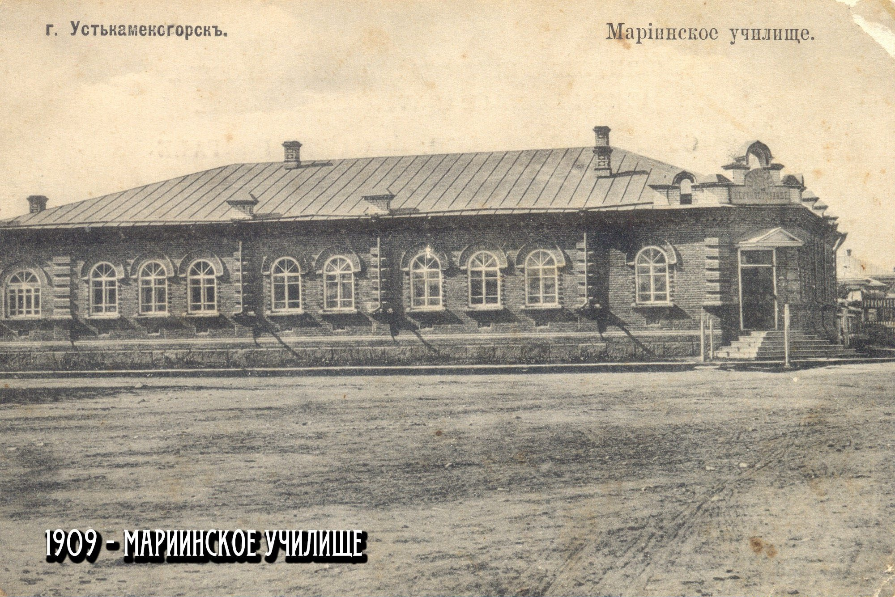
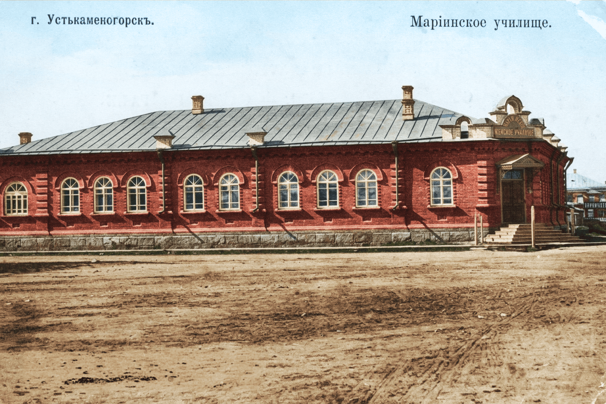

# Маріинское училище[^1]

Показано кирпичное здание со следующими характеристиками:
- металлическая крыша
- каменный фундамент
- 10 светлых, деревянных окон - 9 однотипных и 1 широкое с дополнительными перемычками
- три кирпичные трубы
  - одна высокая, "двухъярусная"
  - две пониже, "одноярусные"
- 3 металлических водосточных трубы спереди и 3 по краю
- вывеска над главным входом с круговой надписью "МАРІИНСКОЕ"; ниже – прямая надпись "ЖЕНСКОЕ УЧИЛИЩЕ"

Вдали виднеется трёхэтажный дом с металлической крышей и слабо различимой надписью "ПАРИКМАХЕР".

---

Цветной вариант (цвета выбраны на усмотрение автора):

[^1]: Мариинское училище
