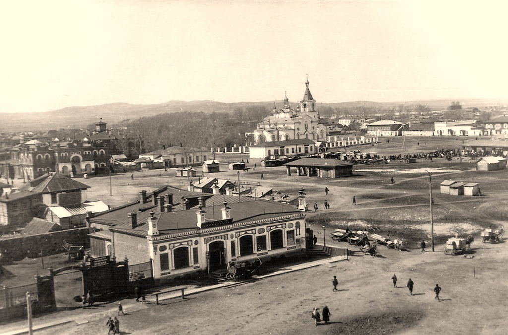

# Дом купца <a href="/people/Kozhevnikov">Кожевникова</a>. 

> Цитата из книги <a href="/books/1990-Shtrihi-k-portretu-goroda">"Штрихи к портрету города"</a>:
>
> В годы первой мировой войны на углу с Пожарным переулком пленными чехами для купца Кожевникова было построено красивое в архитектурном плане здание, где он разместил свой магазин по продаже стеклянной, фаянсовой и другой посуды. Долгие годы в этом помещении находился ресторан "Алтай", теперь — выставочный зал областного этнографического музея.

Вдали виднеются Покровский собор и Народный дом.

Предположительно, фото 1920 г.
