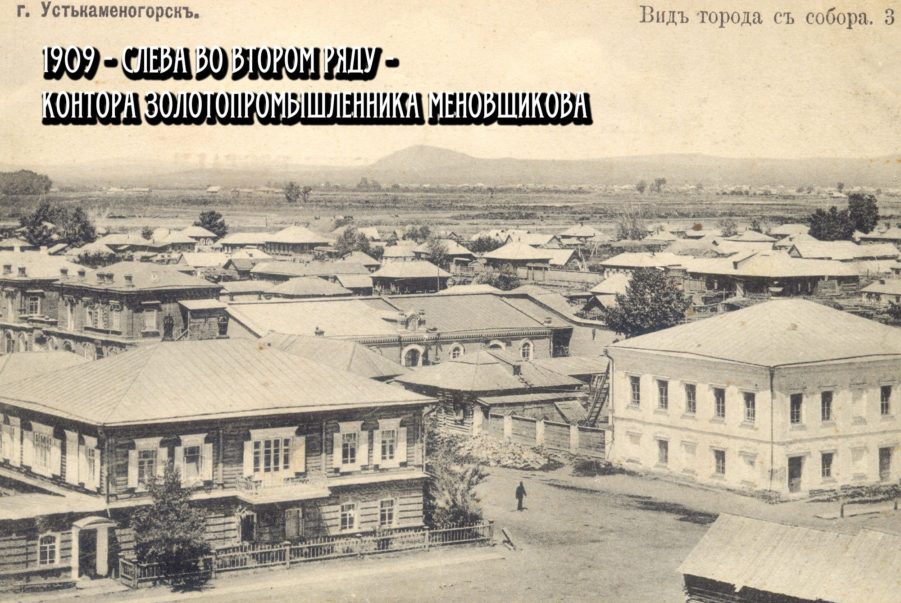

# Вид города с собора. Фото №3

Вид с Покровского собора на угол улицы Большой и Базарного переулка. Слева на заднем фоне виднеется контора золотопромышленника <a href="/people/Menovschikov/">Андрея Савельевича __Меновщикова__</a>. Слева спереди расположен дом <a href="/people/Kurochkin/">Агафона Васильевича __Курочкина__</a>, купца II гильдии.

Фото сделал <a href="/people/Gorlov/">Стефан Автономович __Горлов__</a>, владелец типографии «Горлов и К».
