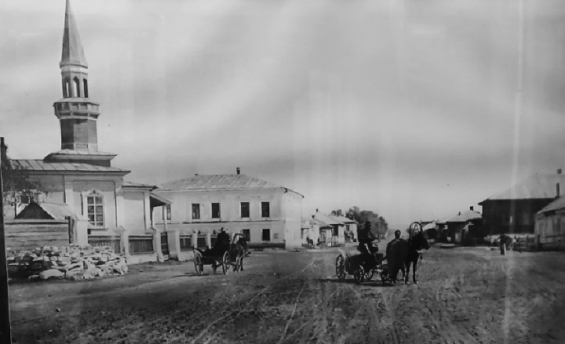

# Троицкая улица. Татарская мечеть

Троицкая улица. Слева на переднем плане - татарская мечеть. Начало XX в.

Расположена по соседству с домом золотопромышленника <a href="/people/Valitov">Валитова</a>.

Возможный год постройки: 1896.

Была снесена в 1935 году.
