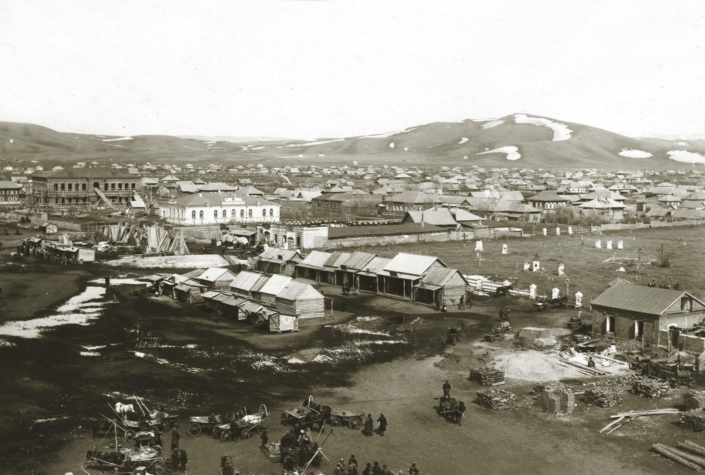

# Вид с колокольни Покровского собора. Сенной базар

> Цитата из книги <a href="/books/1990-Shtrihi-k-portretu-goroda">"Штрихи к портрету города"</a>:
>
> Вид города с колокольни <a href="/photos/postcards-gorlov/pokrovskiy-sobor">Покровского собора</a>. Слева вдали - приходское училище, справа - христианское кладбище 1912 г.
